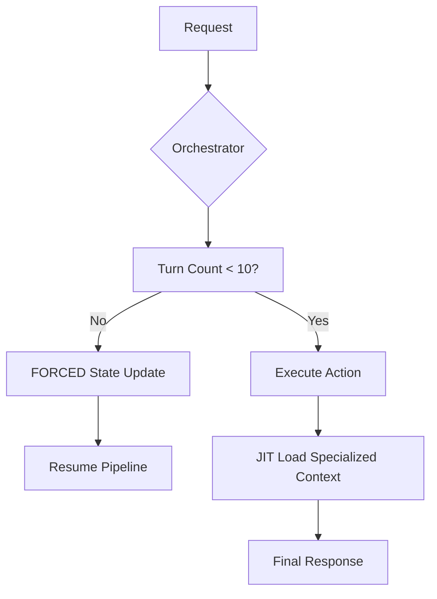

# DivaSwarm Deep Dive: Memory Engineering (v5.1.0)

DivaSwarm v5.1.0 is a state-first, JIT-loaded multi-agent orchestration system.

## 1. The State Integrity Watchdog

To prevent "System Collapse," v5.1.0 introduces a **Heartbeat Interrupt**.

### The Watchdog Intercept
1. **Turn Counter**: The system tracks turns since the last `THE_PULSE.md` update.
2. **Hard-Limit**: At **10 turns**, the Orchestrator's internal reasoning is restricted. It *cannot* execute new commands until it has summarized progress into the `# STATE` block.
3. **Analytic Verification**: L3 agents (The Ralph/Architect) are structurally required to read the `THE_PULSE.md` *every turn* to ensure alignment.

## 2. JIT (Just-In-Time) Agent Registry

To maximize **Token Runway**, DivaSwarm no longer loads all 15+ agents into every turn's context.

| Mechanism | Method | Impact |
|-----------|--------|--------|
| **Registry** | `agents/registry.md` | Minimal lookup table of names and triggers. |
| **JIT Loading** | `view_file` | Loads full `.agent.md` context ONLY when triggered. |
| **Idle Savings** | Pruning | Saves ~4,000 tokens per turn during routine L1/L2 work. |

## 3. Thinking Levels (L1-L3)

| Level | Name | Memory Type | Tooling |
|-------|------|-------------|---------|
| **L1** | Reflex | Ephemeral | Direct Command |
| **L2** | Reasoning | Working | Thought Signature |
| **L3** | Deep Analysis | Structural | Specialist Agent + JIT Load |

## 4. The Ghost Sequence (Systematic Debugging)

1. **Isolation**: Minimal reproduction script.
2. **Trace**: Use **Architect** (via JIT load) to map data flow.
3. **Fix**: Apply atomic change via **Executor**.
4. **Verify**: Confirm with **QA-Tester**.

## 5. Dialectical Validation Architecture

To achieve "Absolute Certainty," v5.1.0 supports **Dialectical Reasoning** in the final build phase.

### The Skeptic vs. The Believer
- **The Skeptic**: Performs a factual audit of why the solution might fail (API limits, race conditions).
- **The Believer**: Performs a counter-audit of how those failures are mitigated.
- **Synthesis**: The Orchestrator resolves the conflict into a "Hardened Solution."

---
*DivaSwarm v5.1.0: Memory-Safe. Token-Efficient. Relentless.*
